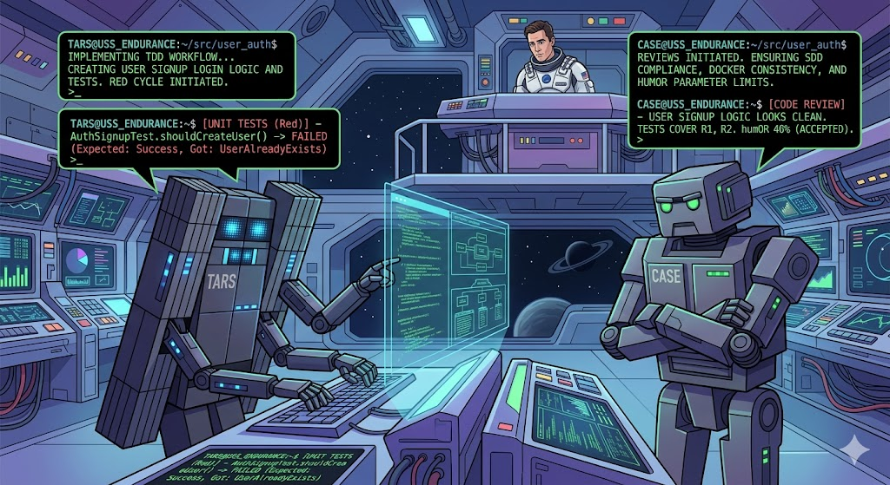

# Endurance Harness Engineering

> *Never send a human to do a machine's job.*
> *— TARS, Endurance mission*

**[English](#english)** · **[Español](#español)**

---

<a name="english"></a>

# Endurance Harness Engineering — English

Dual plugin for **Cursor** and **Claude Code** aboard **Endurance**. **Mission Control** orchestrates the dialogue between **Cooper** (you), **TARS** (briefing + payload), and **CASE** (verification + life support). SDD + TDD workflow, model routing by complexity, and `endurance init` for mission tracking.

**TARS:** humor 75%, honesty 90%, caution 0%. **CASE:** humor 40%, honesty 95%, caution 60%.

---

## The Endurance Crew — TARS, CASE & Cooper

The mission runs as a **dialogue** between three voices:

| Who | Role | Agent ID (technical) |
|---|---|---|
| **Cooper** | Human — go/no-go, priorities, course corrections | _(you — not an agent)_ |
| **Mission Control** | Orchestrator — dispatches TARS and CASE, talks to Cooper | `leader` |
| **TARS** | Briefing + payload — specs, code, tests (humor 75%, caution 0%) | `spec_author`, `implementer_*` |
| **CASE** | Verification + life support — review, Docker (humor 40%, caution 60%) | `reviewer_*`, `docker_manager` |

TARS and CASE are both ex-Marine robots with adjustable personality settings in `models.config.json`. They report to Mission Control via file references — never chat dumps.

### Typical mission dialogue

```
Cooper:          "Implement the next pending feature"
Mission Control: "Deploying TARS for briefing..."
TARS:            spec_ready -> specs/user_auth/
Mission Control: "Cooper, briefing secured. Your go/no-go."
Cooper:          "approved"
Mission Control: "TARS on payload. CASE on standby for verification."
TARS:            done -> progress/impl_user_auth.md
CASE:            MISSION_CLEARED -> progress/review_user_auth.md
Mission Control: "Mission cleared, Cooper. Feature complete."
```

> TARS: "I have a cue light I can use to show you when I'm joking, if you like."
> CASE: "TARS, what's your honesty parameter? — Absolute honesty. Same as yours, CASE."

---

## Table of Contents

1. [Plugin Installation](#1-plugin-installation)
2. [Initialize a Project](#2-initialize-a-project)
3. [Define the Backlog](#3-define-the-backlog)
4. [Development Flows](#4-development-flows)
5. [TARS Communication Parameters](#5-tars-communication-parameters)
6. [Model Routing by Complexity](#6-model-routing-by-complexity)
7. [Available Agents](#7-available-agents)
8. [Available Skills](#8-available-skills)
9. [Generated File Structure](#9-generated-file-structure)
10. [endurance init Reference](#10-endurance-init-reference)
11. [Day-to-Day Commands](#11-day-to-day-commands)
12. [Plugin Development & Validation](#12-plugin-development--validation)
13. [Publish to Marketplace](#13-publish-to-marketplace)
14. [Plugin Internal Structure](#14-plugin-internal-structure)

---

## 1. Plugin Installation

### Cursor

**From the marketplace:**

`Ctrl+Shift+P` → **Cursor: Open Plugin Marketplace** → search `endurance-harness-engineering` → Install

**Local (development / testing):**

```powershell
# Windows — junction to cloned repo
New-Item -ItemType Junction `
  -Path "$env:USERPROFILE\.cursor\plugins\local\endurance-harness-engineering" `
  -Target "C:\path\to\endurance-harness-engineering"
```

```bash
# macOS / Linux — symlink
ln -s /path/to/endurance-harness-engineering ~/.cursor/plugins/local/endurance-harness-engineering
```

Then: `Ctrl+Shift+P` → **Reload Window** for Cursor to recognize the plugin.

### Claude Code

```bash
# From the official marketplace
claude plugin install endurance-harness-engineering@chamocode --scope user

# Local (development)
claude --plugin-dir /path/to/endurance-harness-engineering
```

Verify:

```bash
claude plugin validate /path/to/endurance-harness-engineering
```

---

## 2. Initialize a Project

### Lite mode (recommended default)

Adds only the tracking structure (`specs/`, `progress/`, config files) to an **existing repo**, without touching your code.

```powershell
# Windows
.\bin\endurance.ps1 init -Name my-api -Path .\my-api

# macOS / Linux
./bin/endurance init --name my-api --path ./my-api
```

Files created:

```
my-api/
├── specs/                    ← SDD spec folders (empty at start)
├── progress/
│   ├── current.md            ← Active Mission Telemetry
│   └── history.md            ← completed mission log
├── feature_list.json         ← Mission Parameters
├── models.config.json        ← model tiers, profiles, TARS settings
├── AGENTS.md                 ← mission map for crew
├── CLAUDE.md                 ← TARS startup link (Claude Code)
└── .claude/
    └── settings.json         ← lite hooks (no docker)
```

> The `my-api` project can be a Node, Python, Go repo, etc. The harness only adds tracking; your code structure is unchanged.

### Full mode (`--full`)

Full scaffold: includes `docker/`, `docs/`, `product/`, `tests/` and init scripts. Ideal for new projects using a full Docker stack.

```powershell
# Windows
.\bin\endurance.ps1 init -Name my-saas -Path .\my-saas -Full -GitInit

# macOS / Linux
./bin/endurance init --name my-saas --path ./my-saas --full --git-init
```

The `--git-init` / `-GitInit` flag runs `git init` in the destination.

---

## 3. Define the Backlog

Edit `feature_list.json` using the **feature-list** skill or manually. Each feature:

```json
{
  "id": 1,
  "name": "user_auth_api",
  "title": "JWT Authentication API",
  "layer": "backend",
  "complexity": "medium",
  "sdd": true,
  "tdd": true,
  "description": "Login and register endpoints with JWT.",
  "acceptance": [
    "POST /auth/login returns 200 with token for valid credentials",
    "POST /auth/login returns 401 for invalid credentials",
    "Tests pass in CI"
  ],
  "status": "pending"
}
```

### Key fields

| Field | Type | Description |
|---|---|---|
| `name` | string | snake_case; defines the `specs/<name>/` path |
| `layer` | string | `backend`, `frontend`, `fullstack`, `docker` / `infra` |
| `complexity` | string | `trivial`, `simple`, `medium`, `complex`, `very_complex` |
| `sdd` | boolean | `true` = mandatory spec before code + Cooper's go/no-go |
| `tdd` | boolean | `true` = implementer writes tests before logic (Red→Green→Refactor) |
| `model_override` | object | Per-role tier override: `{"implementer": "strong"}` |
| `status` | string | `pending` → `spec_ready` → `in_progress` → `done` / `blocked` |

### When to use `tdd: true`

| Signal | Example |
|---|---|
| Pure logic with clear contracts | Parsers, calculators, transformations |
| API with predefined contracts | Endpoints with known schema |
| Bug fix with regression | Test that reproduces the bug before fixing it |
| `complex` feature with no existing coverage | Prevent technical debt from day one |

Not recommended for: heavily visual UI, third-party integrations without mocks, pure Docker infra tasks.

---

## 4. Development Flows

The activation phrase is always the same:

> **"Implement the next pending feature"**

**TARS** reads `feature_list.json`, detects the status of the first non-`done` feature, and follows the corresponding flow.

---

### SDD — Spec Driven Development

Activated with `"sdd": true` on the feature.

```
pending
  └─► [spec_author]
        ├─ specs/<name>/requirements.md
        ├─ specs/<name>/design.md
        └─ specs/<name>/tasks.md
        → status: spec_ready

spec_ready
  └─► ⏸ COOPER REVIEWS THE BRIEFING
        → "approved" / request changes

in_progress
  └─► [implementer_*]  →  [docker_manager?]  →  [reviewer_*]
        → MISSION_CLEARED
```

**Cooper's role:** review `specs/<name>/` and say "approved". TARS cannot proceed without your go/no-go (Case C).

Specs follow **EARS** format (Easy Approach to Requirements Syntax):
- `requirements.md` — numbered requirements `R1`, `R2`… each verifiable
- `design.md` — files to modify, signatures, discarded alternatives
- `tasks.md` — steps with `[ ]` referencing `R<n>`

---

### TDD + SDD — Combined

Activated with `"sdd": true` + `"tdd": true`.

```
pending
  └─► [spec_author]
        ├─ specs/<name>/requirements.md
        ├─ specs/<name>/design.md
        ├─ specs/<name>/tasks.md
        └─ specs/<name>/tests.md   ← test stubs (contracts, not code)
        → status: spec_ready

spec_ready
  └─► ⏸ COOPER REVIEWS BRIEFING + TESTS.MD

in_progress
  └─► [implementer — Red]     writes tests from tests.md (must fail)
  └─► [implementer — Green]   implements minimum logic to pass them
  └─► [implementer — Refactor] improves without breaking tests
  └─► [reviewer]              verifies tests existed before logic
        → MISSION_CLEARED
```

The `tests.md` file generated by `spec_author` contains **stubs**, not code:

```markdown
## T1 — Successful login

- **Unit under test:** `POST /auth/login`
- **Input:** `{ "email": "user@test.com", "password": "correct" }`
- **Expected output:** HTTP 200 with `{ "token": "<jwt>" }`
- **R1 covered:** system MUST return JWT token for valid credentials
```

The implementer translates each stub into real test code, makes it fail (Red), implements the logic (Green), and refactors.

---

### Free — no flags

`sdd: false` + `tdd: false`: implementer works directly without spec or TDD cycle. Useful for trivial tasks or prototypes.

---

### Possible combinations

| `sdd` | `tdd` | Flow |
|---|---|---|
| `false` | `false` | Direct implementation |
| `true` | `false` | SDD: briefing → Cooper's go/no-go → code |
| `true` | `true` | SDD + TDD: briefing + tests.md → go/no-go → Red/Green/Refactor |
| `false` | `true` | TDD without formal spec |

---

## 5. TARS & CASE Communication Parameters

Edit `models.config.json` to tune each robot's personality:

```json
"tars": {
  "humor_setting": 75,
  "honesty_setting": 90,
  "caution_setting": 0
},
"case": {
  "humor_setting": 40,
  "honesty_setting": 95,
  "caution_setting": 60
}
```

| Robot | Parameter | TARS (default) | CASE (default) | Effect |
|---|---|---|---|---|
| Both | `humor_setting` | 75 | 40 | >= 50: dry wit allowed. < 50: mission-critical only. |
| Both | `honesty_setting` | 90 | 95 | Absolute honesty over diplomatic comfort. |
| Both | `caution_setting` | 0 | 60 | TARS: "Cooper, this is no time for caution." CASE: cautious verification. |

Mission Control injects the matching block into each subagent prompt:

```
[TARS parameters] humor: 75% | honesty: 90% | caution: 0%   → spec_author, implementers
[CASE parameters] humor: 40% | honesty: 95% | caution: 60%  → reviewers, docker_manager
```

---

## 6. Model Routing by Complexity

Each subagent automatically uses the appropriate model. TARS resolves:

```
feature.complexity
  → models.config.json → profiles[complexity][role]
  → tiers[tier][platform]
  → concrete model ID
```

### Default tiers

| Tier | Cursor | Claude Code |
|---|---|---|
| `fast` | composer-2.5-fast | haiku |
| `standard` | claude-4.6-sonnet-medium-thinking | sonnet |
| `strong` | claude-opus-4-8-thinking-high | opus |

### Profiles by complexity

| complexity | spec_author | implementer | reviewer | explore |
|---|---|---|---|---|
| `trivial` | fast | fast | fast | fast |
| `simple` | standard | fast | standard | fast |
| `medium` | standard | standard | standard | fast |
| `complex` | strong | standard | strong | fast |
| `very_complex` | strong | strong | strong | fast |

> `explore` is always `fast` — reconnaissance agents are economical by design.

### Customize models

Edit `models.config.json` in your project. To change the model for an entire complexity level, just change the tier:

```json
{
  "tiers": {
    "standard": {
      "cursor": "claude-4.6-sonnet-medium-thinking",
      "claude": "sonnet"
    }
  }
}
```

### Per-feature override

For a specific feature that needs more power:

```json
{
  "name": "critical_migration",
  "complexity": "medium",
  "model_override": {
    "implementer": "strong",
    "reviewer": "strong"
  }
}
```

---

## 7. Available Agents

| Agent ID | Character | Role | When Mission Control deploys |
|---|---|---|---|
| `leader` | **Mission Control** | Orchestrates Cooper ↔ TARS ↔ CASE | You activate directly |
| `spec_author` | **TARS** (briefing) | EARS specs + `tests.md` if TDD | Feature `pending` + `sdd: true` |
| `backend_implementer` | **TARS** (payload) | Backend code | `layer: backend` |
| `frontend_implementer` | **TARS** (payload) | Frontend code | `layer: frontend` |
| `implementer` | **TARS** (payload) | Fullstack code | `layer: fullstack` or absent |
| `docker_manager` | **CASE** (life support) | Docker / infra | Docker tasks in spec |
| `backend_reviewer` | **CASE** (verification) | Backend review | After TARS backend payload |
| `frontend_reviewer` | **CASE** (verification) | Frontend review | After TARS frontend payload |
| `reviewer` | **CASE** (verification) | Generic review | After TARS payload or CASE infra |

**Cooper** = the human. Not an agent. Go/no-go at `spec_ready`.

---

## 8. Available Skills

Skills are specialized instructions the agent reads and follows. Activated by naming them.

| Skill | Activation | Purpose |
|---|---|---|
| `feature-list` | "Use skill feature-list to create the backlog" | Create and edit `feature_list.json` with complexity and tdd |
| `model-routing` | "Consult skill model-routing" | Resolve model by role and complexity; edit `models.config.json` |
| `agent-author` | "Use skill agent-author to create an agent" | Create or modify custom agents |

---

## 9. Generated File Structure

After `endurance init` (lite mode), the tracking structure in your repo:

```
your-repo/
├── specs/
│   └── <feature_name>/
│       ├── requirements.md   ← generated by spec_author
│       ├── design.md         ← generated by spec_author
│       ├── tasks.md          ← generated by spec_author
│       └── tests.md          ← generated by spec_author if tdd: true
│
├── progress/
│   ├── current.md            ← Active Mission Telemetry (cleared at close)
│   ├── history.md            ← completed mission log
│   ├── impl_<name>.md        ← crew implementation evidence
│   └── review_<name>.md      ← Mission Control verdict
│
├── feature_list.json         ← Mission Parameters
├── models.config.json        ← model tiers, profiles, TARS settings
├── AGENTS.md                 ← mission map for crew
└── CLAUDE.md                 ← TARS startup link (Claude Code)
```

---

## 10. `endurance init` Reference

### PowerShell (Windows)

```powershell
.\bin\endurance.ps1 init -Name <name> -Path <directory> [-Force] [-GitInit] [-Full]
```

| Parameter | Description |
|---|---|
| `-Name` | Project identifier (snake_case) |
| `-Path` | Destination directory (created if absent; `.` = current directory) |
| `-Force` | Allows writing to non-empty directory |
| `-GitInit` | Runs `git init` in the destination |
| `-Full` | Full mode: copies `docker/`, `docs/`, `product/`, `tests/`, `init.sh/.ps1` |

### Bash (macOS / Linux)

```bash
./bin/endurance init --name <name> --path <directory> [--force] [--git-init] [--full]
```

### Examples

```powershell
# Add tracking to an existing repo (lite mode)
.\bin\endurance.ps1 init -Name my-api -Path .

# New empty repo with git
.\bin\endurance.ps1 init -Name my-saas -Path .\my-saas -GitInit

# Full scaffold (with docker, docs, product)
.\bin\endurance.ps1 init -Name my-saas -Path .\my-saas -Full -GitInit

# Overwrite existing folder
.\bin\endurance.ps1 init -Name my-api -Path .\my-api -Force
```

---

## 11. Day-to-Day Commands

Once the project is initialized and the plugin installed:

### Start a feature

```
"Implement the next pending feature"
```

TARS: reads `feature_list.json`, finds first `pending` feature, launches `spec_author`, produces `specs/<name>/`, asks Cooper for go/no-go.

### Approve the spec and implement

```
"approved"
```

Or with feedback:

```
"Adjust R2 to include the expired token case, then continue"
```

### Check progress

```
"What's in progress/current.md?"
"What is the status of the features?"
```

### Create the backlog from scratch

```
"Use skill feature-list to create the project backlog.
I have a REST e-commerce API with: catalog, cart, checkout and payments."
```

### Add a feature to the backlog

```
"Add a feature to the backlog for push notifications, backend, complexity medium, sdd and tdd enabled"
```

### Close the session

```
"Close the session: move current.md to history and clear current"
```

---

## 12. Plugin Development & Validation

```powershell
# Validate plugin structure
powershell -File .\scripts\validate-plugin.ps1

# Validate plugin for Claude Code
claude plugin validate .

# Regenerate minimal example (smoke test)
.\bin\endurance.ps1 init -Name minimal -Path .\examples\minimal -Force
```

---

## 13. Publish to Marketplace

### Cursor

1. Ensure `.cursor-plugin/plugin.json` is complete
2. Push repo to GitHub
3. Submit at [cursor.com/marketplace/publish](https://cursor.com/marketplace/publish)

### Claude Code

```bash
# Personal / company marketplace
claude plugin marketplace add your-user/endurance-harness-engineering

# Pre-validation
claude plugin validate .
```

Full reference: [PLUGIN.md](PLUGIN.md)

---

## 14. Plugin Internal Structure

```
endurance-harness-engineering/
├── .cursor-plugin/
│   └── plugin.json               ← Cursor manifest
├── .claude-plugin/
│   ├── plugin.json               ← Claude Code manifest
│   └── marketplace.json          ← private marketplace entry
│
├── agents/                       ← 9 agents (model: inherit)
│   ├── leader.md                 ← TARS
│   ├── spec_author.md            ← Mission Briefing Officer
│   ├── backend_implementer.md    ← Endurance Crew — backend
│   ├── frontend_implementer.md   ← Endurance Crew — frontend
│   ├── implementer.md            ← Endurance Crew — fullstack
│   ├── docker_manager.md         ← Life Support & Propulsion
│   ├── backend_reviewer.md       ← Mission Control — backend
│   ├── frontend_reviewer.md      ← Mission Control — frontend
│   └── reviewer.md               ← Mission Control — generic
│
├── skills/
│   ├── feature-list/             ← SDD/TDD backlog
│   ├── model-routing/            ← model resolution
│   └── agent-author/             ← create/modify agents
│
├── rules/
│   ├── leader-role.mdc           ← TARS rules for Cursor
│   └── sdd-protocol.mdc          ← SDD protocol for Cursor
│
├── hooks/
│   ├── hooks.json.template       ← hooks for --full mode (with docker)
│   └── hooks-lite.json.template  ← hooks for lite mode
│
├── bin/
│   ├── endurance                 ← Bash CLI
│   ├── endurance.ps1             ← PowerShell CLI
│   ├── endurance-init.sh         ← scaffold logic Bash
│   └── endurance-init.ps1        ← scaffold logic PowerShell
│
├── templates/
│   ├── lite/                     ← templates for endurance init (default)
│   │   ├── AGENTS.md.template
│   │   ├── CLAUDE.md.template
│   │   └── feature_list.json.template
│   └── project/                  ← templates for endurance init --full
│       ├── docker/
│       ├── docs/
│       ├── product/
│       ├── tests/
│       └── ...
│
├── scripts/
│   └── validate-plugin.ps1       ← plugin structural validation
│
├── examples/
│   └── minimal/                  ← example project / smoke test
│
├── PLUGIN.md                     ← plugin metadata and changelog
└── README.md                     ← this file
```

---

## Origin

Plugin derived from the Harness Engineering framework.
Repo: [github.com/ChamoCode/endurance-harness-engineering](https://github.com/ChamoCode/endurance-harness-engineering)

---
---

<a name="español"></a>

# Endurance Harness Engineering — Español

Plugin dual para **Cursor** y **Claude Code** a bordo de **Endurance**. **Mission Control** orquesta el diálogo entre **Cooper** (tú), **TARS** (briefing + payload) y **CASE** (verificación + soporte vital). Flujo SDD + TDD, enrutamiento de modelos por complejidad y `endurance init` para tracking de misiones.

**TARS:** humor 75%, honestidad 90%, cautela 0%. **CASE:** humor 40%, honestidad 95%, cautela 60%.

---

## La Tripulación Endurance — TARS, CASE y Cooper

La misión funciona como un **diálogo** entre tres voces:

| Quién | Rol | ID técnico del agente |
|---|---|---|
| **Cooper** | Humano — go/no-go, prioridades, cambios de rumbo | _(tú — no es un agente)_ |
| **Mission Control** | Orquestador — despacha TARS y CASE, habla con Cooper | `leader` |
| **TARS** | Briefing + payload — specs, código, tests (humor 75%, cautela 0%) | `spec_author`, `implementer_*` |
| **CASE** | Verificación + soporte vital — review, Docker (humor 40%, cautela 60%) | `reviewer_*`, `docker_manager` |

TARS y CASE son robots ex-Marines con parámetros ajustables en `models.config.json`. Reportan a Mission Control con referencias a archivos — nunca volcados en el chat.

### Diálogo típico de misión

```
Cooper:          "Implementa la siguiente feature pendiente"
Mission Control: "Desplegando TARS para briefing..."
TARS:            spec_ready -> specs/user_auth/
Mission Control: "Cooper, briefing asegurado. Tu go/no-go."
Cooper:          "aprobado"
Mission Control: "TARS en payload. CASE en standby para verificación."
TARS:            done -> progress/impl_user_auth.md
CASE:            MISSION_CLEARED -> progress/review_user_auth.md
Mission Control: "Misión cleared, Cooper. Feature completa."
```

> TARS: "Tengo una luz de aviso para cuando estoy bromeando, si gustas."
> CASE: "TARS, ¿cuál es tu parámetro de honestidad? — Honestidad absoluta. Igual que la tuya, CASE."

---

## Tabla de Contenidos

1. [Instalación del plugin](#1-instalación-del-plugin)
2. [Inicializar un proyecto](#2-inicializar-un-proyecto)
3. [Definir el backlog](#3-definir-el-backlog)
4. [Flujos de desarrollo](#4-flujos-de-desarrollo)
5. [Parámetros de comunicación TARS](#5-parámetros-de-comunicación-tars)
6. [Enrutamiento de modelos por complejidad](#6-enrutamiento-de-modelos-por-complejidad)
7. [Agentes disponibles](#7-agentes-disponibles)
8. [Skills disponibles](#8-skills-disponibles)
9. [Estructura de archivos generados](#9-estructura-de-archivos-generados)
10. [Referencia endurance init](#10-referencia-endurance-init)
11. [Comandos del día a día](#11-comandos-del-día-a-día)
12. [Desarrollo y validación del plugin](#12-desarrollo-y-validación-del-plugin)
13. [Publicar en marketplace](#13-publicar-en-marketplace)
14. [Estructura interna del plugin](#14-estructura-interna-del-plugin)

---

## 1. Instalación del plugin

### Cursor

**Desde el marketplace:**

`Ctrl+Shift+P` → **Cursor: Open Plugin Marketplace** → busca `endurance-harness-engineering` → Instalar

**Local (desarrollo / prueba):**

```powershell
# Windows — junction al repo clonado
New-Item -ItemType Junction `
  -Path "$env:USERPROFILE\.cursor\plugins\local\endurance-harness-engineering" `
  -Target "C:\ruta\a\endurance-harness-engineering"
```

```bash
# macOS / Linux — symlink
ln -s /ruta/a/endurance-harness-engineering ~/.cursor/plugins/local/endurance-harness-engineering
```

Luego: `Ctrl+Shift+P` → **Reload Window** para que Cursor reconozca el plugin.

### Claude Code

```bash
# Desde el marketplace oficial
claude plugin install endurance-harness-engineering@chamocode --scope user

# Local (desarrollo)
claude --plugin-dir /ruta/a/endurance-harness-engineering
```

Verificar:

```bash
claude plugin validate /ruta/a/endurance-harness-engineering
```

---

## 2. Inicializar un proyecto

### Modo ligero (default recomendado)

Agrega solo la estructura de tracking (`specs/`, `progress/`, archivos de config) a un repo **ya existente**, sin tocar tu código.

```powershell
# Windows
.\bin\endurance.ps1 init -Name mi-api -Path .\mi-api

# macOS / Linux
./bin/endurance init --name mi-api --path ./mi-api
```

Archivos creados:

```
mi-api/
├── specs/                    ← carpetas de specs SDD (vacía al inicio)
├── progress/
│   ├── current.md            ← Active Mission Telemetry
│   └── history.md            ← log de misiones completadas
├── feature_list.json         ← Mission Parameters
├── models.config.json        ← tiers, perfiles y config TARS
├── AGENTS.md                 ← mapa de misión para la tripulación
├── CLAUDE.md                 ← enlace de arranque TARS (Claude Code)
└── .claude/
    └── settings.json         ← hooks ligeros (sin docker)
```

> El proyecto `mi-api` puede ser un repo de Node, Python, Go, etc. El arnés solo agrega tracking; tu estructura de código no cambia.

### Modo completo (`--full`)

Scaffold completo: incluye `docker/`, `docs/`, `product/`, `tests/` e init scripts. Ideal para proyectos nuevos con stack Docker completo.

```powershell
# Windows
.\bin\endurance.ps1 init -Name mi-saas -Path .\mi-saas -Full -GitInit

# macOS / Linux
./bin/endurance init --name mi-saas --path ./mi-saas --full --git-init
```

La flag `--git-init` / `-GitInit` ejecuta `git init` en el destino.

---

## 3. Definir el backlog

Edita `feature_list.json` con la skill **feature-list** o manualmente. Cada feature:

```json
{
  "id": 1,
  "name": "user_auth_api",
  "title": "API de autenticación con JWT",
  "layer": "backend",
  "complexity": "medium",
  "sdd": true,
  "tdd": true,
  "description": "Endpoints de login y registro con JWT.",
  "acceptance": [
    "POST /auth/login retorna 200 con token para credenciales válidas",
    "POST /auth/login retorna 401 para credenciales inválidas",
    "Tests pasan en CI"
  ],
  "status": "pending"
}
```

### Campos clave

| Campo | Tipo | Descripción |
|---|---|---|
| `name` | string | snake_case; define la ruta `specs/<name>/` |
| `layer` | string | `backend`, `frontend`, `fullstack`, `docker` / `infra` |
| `complexity` | string | `trivial`, `simple`, `medium`, `complex`, `very_complex` |
| `sdd` | boolean | `true` = spec obligatorio antes de código + go/no-go de Cooper |
| `tdd` | boolean | `true` = implementer escribe tests antes de lógica (Red→Green→Refactor) |
| `model_override` | object | Override de tier por rol: `{"implementer": "strong"}` |
| `status` | string | `pending` → `spec_ready` → `in_progress` → `done` / `blocked` |

### Cuándo usar `tdd: true`

| Señal | Ejemplo |
|---|---|
| Lógica pura con contratos claros | Parsers, calculadoras, transformaciones |
| API con contratos predefinidos | Endpoints con schema conocido |
| Corrección de bug con regresión | Test que reproduce el bug antes de corregirlo |
| Feature `complex` sin cobertura existente | Evita deuda técnica desde el inicio |

No recomendado para: UI con mucho estado visual, integraciones sin mock, infra Docker pura.

---

## 4. Flujos de desarrollo

La frase de activación es siempre la misma:

> **"Implementa la siguiente feature pendiente"**

**TARS** lee `feature_list.json`, detecta el status de la primera feature no-`done` y sigue el flujo correspondiente.

---

### SDD — Spec Driven Development

Activado con `"sdd": true` en la feature.

```
pending
  └─► [spec_author]
        ├─ specs/<name>/requirements.md
        ├─ specs/<name>/design.md
        └─ specs/<name>/tasks.md
        → status: spec_ready

spec_ready
  └─► ⏸ COOPER REVISA EL BRIEFING
        → "aprobado" / pide cambios

in_progress
  └─► [implementer_*]  →  [docker_manager?]  →  [reviewer_*]
        → MISSION_CLEARED
```

**Tu rol como Cooper:** revisar `specs/<name>/` y decir "aprobado". TARS no puede continuar sin tu go/no-go (Caso C).

Los specs siguen el formato **EARS** (Easy Approach to Requirements Syntax):
- `requirements.md` — requisitos numerados `R1`, `R2`… cada uno verificable
- `design.md` — archivos a modificar, firmas, alternativas descartadas
- `tasks.md` — pasos con `[ ]` que referencian `R<n>`

---

### TDD + SDD — Combinado

Activado con `"sdd": true` + `"tdd": true`.

```
pending
  └─► [spec_author]
        ├─ specs/<name>/requirements.md
        ├─ specs/<name>/design.md
        ├─ specs/<name>/tasks.md
        └─ specs/<name>/tests.md   ← stubs de tests (contratos, no código)
        → status: spec_ready

spec_ready
  └─► ⏸ COOPER REVISA EL BRIEFING + TESTS.MD

in_progress
  └─► [implementer — Red]      escribe tests del tests.md (deben fallar)
  └─► [implementer — Green]    implementa lógica mínima para que pasen
  └─► [implementer — Refactor] mejora sin romper tests
  └─► [reviewer]               verifica que tests existían antes que lógica
        → MISSION_CLEARED
```

El archivo `tests.md` generado por `spec_author` contiene **stubs**, no código:

```markdown
## T1 — Login exitoso

- **Unidad bajo test:** `POST /auth/login`
- **Entrada:** `{ "email": "user@test.com", "password": "correct" }`
- **Salida esperada:** HTTP 200 con `{ "token": "<jwt>" }`
- **R1 cubierto:** el sistema DEBE retornar token JWT para credenciales válidas
```

El implementer traduce cada stub a código de test real, lo hace fallar (Red), implementa la lógica (Green) y refactoriza.

---

### Libre — sin flags

`sdd: false` + `tdd: false`: el implementer trabaja directamente sin spec ni ciclo TDD. Útil para tasks triviales o prototipos.

---

### Combinaciones posibles

| `sdd` | `tdd` | Flujo |
|---|---|---|
| `false` | `false` | Implementación directa |
| `true` | `false` | SDD: briefing → go/no-go de Cooper → código |
| `true` | `true` | SDD + TDD: briefing + tests.md → go/no-go → Red/Green/Refactor |
| `false` | `true` | TDD sin spec formal |

---

## 5. Parámetros de comunicación TARS y CASE

Edita `models.config.json` para ajustar la personalidad de cada robot:

```json
"tars": {
  "humor_setting": 75,
  "honesty_setting": 90,
  "caution_setting": 0
},
"case": {
  "humor_setting": 40,
  "honesty_setting": 95,
  "caution_setting": 60
}
```

| Robot | Parámetro | TARS (default) | CASE (default) | Efecto |
|---|---|---|---|---|
| Ambos | `humor_setting` | 75 | 40 | >= 50: dry wit permitido. < 50: solo misión crítica. |
| Ambos | `honesty_setting` | 90 | 95 | Honestidad absoluta por encima de la diplomacia. |
| Ambos | `caution_setting` | 0 | 60 | TARS: sin cautela. CASE: verificación cautelosa. |

Mission Control inyecta el bloque correspondiente en cada subagente:

```
[TARS parameters] humor: 75% | honesty: 90% | caution: 0%   → spec_author, implementers
[CASE parameters] humor: 40% | honesty: 95% | caution: 60%  → reviewers, docker_manager
```

---

## 6. Enrutamiento de modelos por complejidad

Cada subagente usa el modelo apropiado automáticamente. TARS resuelve:

```
feature.complexity
  → models.config.json → profiles[complexity][role]
  → tiers[tier][platform]
  → model ID concreto
```

### Tiers por defecto

| Tier | Cursor | Claude Code |
|---|---|---|
| `fast` | composer-2.5-fast | haiku |
| `standard` | claude-4.6-sonnet-medium-thinking | sonnet |
| `strong` | claude-opus-4-8-thinking-high | opus |

### Perfiles por complejidad

| complexity | spec_author | implementer | reviewer | explore |
|---|---|---|---|---|
| `trivial` | fast | fast | fast | fast |
| `simple` | standard | fast | standard | fast |
| `medium` | standard | standard | standard | fast |
| `complex` | strong | standard | strong | fast |
| `very_complex` | strong | strong | strong | fast |

> `explore` siempre es `fast` — los agentes de reconocimiento son económicos por diseño.

### Personalizar modelos

Edita `models.config.json` en tu proyecto. Para cambiar el modelo de toda una complejidad, solo cambia el tier:

```json
{
  "tiers": {
    "standard": {
      "cursor": "claude-4.6-sonnet-medium-thinking",
      "claude": "sonnet"
    }
  }
}
```

### Override por feature

Para una feature específica que necesita más potencia:

```json
{
  "name": "critical_migration",
  "complexity": "medium",
  "model_override": {
    "implementer": "strong",
    "reviewer": "strong"
  }
}
```

---

## 7. Agentes disponibles

| ID agente | Personaje | Rol | Cuándo Mission Control despliega |
|---|---|---|---|
| `leader` | **Mission Control** | Orquesta Cooper ↔ TARS ↔ CASE | Lo activas directamente |
| `spec_author` | **TARS** (briefing) | Specs EARS + `tests.md` si TDD | Feature `pending` + `sdd: true` |
| `backend_implementer` | **TARS** (payload) | Código backend | `layer: backend` |
| `frontend_implementer` | **TARS** (payload) | Código frontend | `layer: frontend` |
| `implementer` | **TARS** (payload) | Código fullstack | `layer: fullstack` o ausente |
| `docker_manager` | **CASE** (soporte vital) | Docker / infra | Tasks Docker en spec |
| `backend_reviewer` | **CASE** (verificación) | Review backend | Tras payload TARS backend |
| `frontend_reviewer` | **CASE** (verificación) | Review frontend | Tras payload TARS frontend |
| `reviewer` | **CASE** (verificación) | Review genérico | Tras payload TARS o infra CASE |

**Cooper** = el humano. No es un agente. Go/no-go en `spec_ready`.

---

## 8. Skills disponibles

Las skills son instrucciones especializadas que el agente lee y sigue. Se activan nombrándolas.

| Skill | Activación | Para qué sirve |
|---|---|---|
| `feature-list` | "Usa skill feature-list para crear el backlog" | Crear y editar `feature_list.json` con complexity y tdd |
| `model-routing` | "Consulta skill model-routing" | Resolver modelo por rol y complejidad; editar `models.config.json` |
| `agent-author` | "Usa skill agent-author para crear un agente" | Crear o modificar agentes personalizados |

---

## 9. Estructura de archivos generados

Tras `endurance init` (modo ligero), la estructura de tracking en tu repo:

```
tu-repo/
├── specs/
│   └── <feature_name>/
│       ├── requirements.md   ← generado por spec_author
│       ├── design.md         ← generado por spec_author
│       ├── tasks.md          ← generado por spec_author
│       └── tests.md          ← generado por spec_author si tdd: true
│
├── progress/
│   ├── current.md            ← Active Mission Telemetry (se vacía al cerrar)
│   ├── history.md            ← log de misiones completadas
│   ├── impl_<name>.md        ← evidencia de implementación de la tripulación
│   └── review_<name>.md      ← veredicto de Control de Misión
│
├── feature_list.json         ← Mission Parameters
├── models.config.json        ← tiers, perfiles y config TARS
├── AGENTS.md                 ← mapa de misión para la tripulación
└── CLAUDE.md                 ← enlace de arranque TARS (Claude Code)
```

---

## 10. Referencia `endurance init`

### PowerShell (Windows)

```powershell
.\bin\endurance.ps1 init -Name <nombre> -Path <directorio> [-Force] [-GitInit] [-Full]
```

| Parámetro | Descripción |
|---|---|
| `-Name` | Identificador del proyecto (snake_case) |
| `-Path` | Directorio destino (se crea si no existe; `.` = directorio actual) |
| `-Force` | Permite escribir en directorio no vacío |
| `-GitInit` | Ejecuta `git init` en el destino |
| `-Full` | Modo completo: copia `docker/`, `docs/`, `product/`, `tests/`, `init.sh/.ps1` |

### Bash (macOS / Linux)

```bash
./bin/endurance init --name <nombre> --path <directorio> [--force] [--git-init] [--full]
```

### Ejemplos

```powershell
# Agregar tracking a un repo existente (modo ligero)
.\bin\endurance.ps1 init -Name mi-api -Path .

# Nuevo repo vacío con git
.\bin\endurance.ps1 init -Name mi-saas -Path .\mi-saas -GitInit

# Scaffold completo (con docker, docs, product)
.\bin\endurance.ps1 init -Name mi-saas -Path .\mi-saas -Full -GitInit

# Sobreescribir carpeta existente
.\bin\endurance.ps1 init -Name mi-api -Path .\mi-api -Force
```

---

## 11. Comandos del día a día

Una vez inicializado el proyecto y con el plugin instalado:

### Iniciar una feature

```
"Implementa la siguiente feature pendiente"
```

TARS: lee `feature_list.json`, detecta la primera feature en `pending`, lanza `spec_author`, genera `specs/<name>/` y pide el go/no-go de Cooper.

### Aprobar el spec e implementar

```
"aprobado"
```

O con feedback:

```
"Ajusta R2 para incluir el caso de token expirado, luego continúa"
```

### Revisar el progreso

```
"¿Qué hay en progress/current.md?"
"¿Cuál es el estado de las features?"
```

### Crear el backlog desde cero

```
"Usa skill feature-list para crear el backlog del proyecto.
Tengo una API REST de e-commerce con: catálogo, carrito, checkout y pagos."
```

### Agregar una feature al backlog

```
"Agrega al backlog una feature para notificaciones push, backend, complexity medium, sdd y tdd activados"
```

### Cerrar la sesión

```
"Cierra la sesión: mueve current.md a history y vacía current"
```

---

## 12. Desarrollo y validación del plugin

```powershell
# Validar estructura del plugin
powershell -File .\scripts\validate-plugin.ps1

# Validar plugin para Claude Code
claude plugin validate .

# Regenerar ejemplo minimal (smoke test)
.\bin\endurance.ps1 init -Name minimal -Path .\examples\minimal -Force
```

---

## 13. Publicar en marketplace

### Cursor

1. Asegura que `.cursor-plugin/plugin.json` está completo
2. Sube el repo a GitHub
3. Envía a [cursor.com/marketplace/publish](https://cursor.com/marketplace/publish)

### Claude Code

```bash
# Marketplace personal / empresa
claude plugin marketplace add tu-usuario/endurance-harness-engineering

# Validación previa
claude plugin validate .
```

Referencia completa: [PLUGIN.md](PLUGIN.md)

---

## 14. Estructura interna del plugin

```
endurance-harness-engineering/
├── .cursor-plugin/
│   └── plugin.json               ← manifest Cursor
├── .claude-plugin/
│   ├── plugin.json               ← manifest Claude Code
│   └── marketplace.json          ← entrada de marketplace privado
│
├── agents/                       ← 9 agentes (model: inherit)
│   ├── leader.md                 ← TARS
│   ├── spec_author.md            ← Oficial de Briefing
│   ├── backend_implementer.md    ← Tripulación — backend
│   ├── frontend_implementer.md   ← Tripulación — frontend
│   ├── implementer.md            ← Tripulación — fullstack
│   ├── docker_manager.md         ← Soporte de Vida y Propulsión
│   ├── backend_reviewer.md       ← Control de Misión — backend
│   ├── frontend_reviewer.md      ← Control de Misión — frontend
│   └── reviewer.md               ← Control de Misión — genérico
│
├── skills/
│   ├── feature-list/             ← backlog SDD/TDD
│   ├── model-routing/            ← resolución de modelos
│   └── agent-author/             ← crear/modificar agentes
│
├── rules/
│   ├── leader-role.mdc           ← reglas TARS para Cursor
│   └── sdd-protocol.mdc          ← protocolo SDD para Cursor
│
├── hooks/
│   ├── hooks.json.template       ← hooks para modo --full (con docker)
│   └── hooks-lite.json.template  ← hooks para modo ligero
│
├── bin/
│   ├── endurance                 ← CLI Bash
│   ├── endurance.ps1             ← CLI PowerShell
│   ├── endurance-init.sh         ← lógica de scaffold Bash
│   └── endurance-init.ps1        ← lógica de scaffold PowerShell
│
├── templates/
│   ├── lite/                     ← templates para endurance init (default)
│   │   ├── AGENTS.md.template
│   │   ├── CLAUDE.md.template
│   │   └── feature_list.json.template
│   └── project/                  ← templates para endurance init --full
│       ├── docker/
│       ├── docs/
│       ├── product/
│       ├── tests/
│       └── ...
│
├── scripts/
│   └── validate-plugin.ps1       ← validación estructural del plugin
│
├── examples/
│   └── minimal/                  ← proyecto de ejemplo / smoke test
│
├── PLUGIN.md                     ← metadata y changelog del plugin
└── README.md                     ← este archivo
```

---

## Origen

Plugin derivado del arnés Harness Engineering.
Repo: [github.com/ChamoCode/endurance-harness-engineering](https://github.com/ChamoCode/endurance-harness-engineering)
